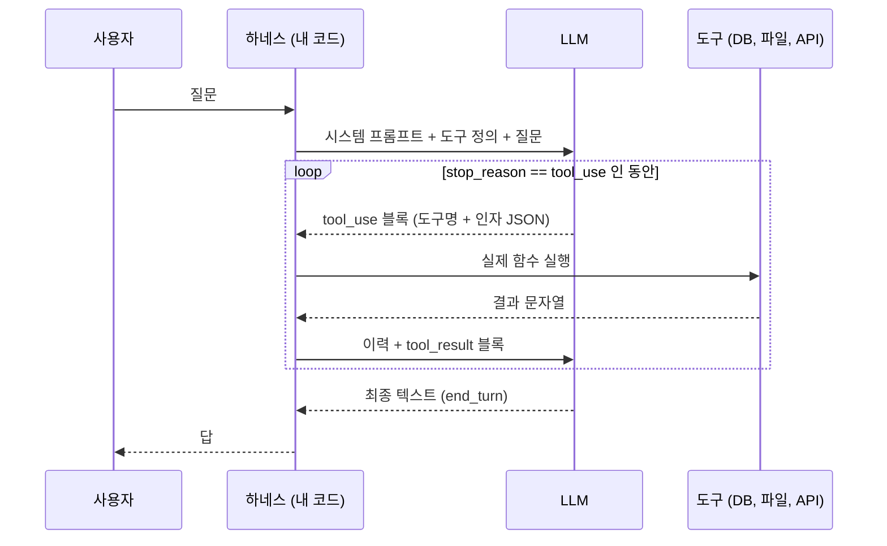
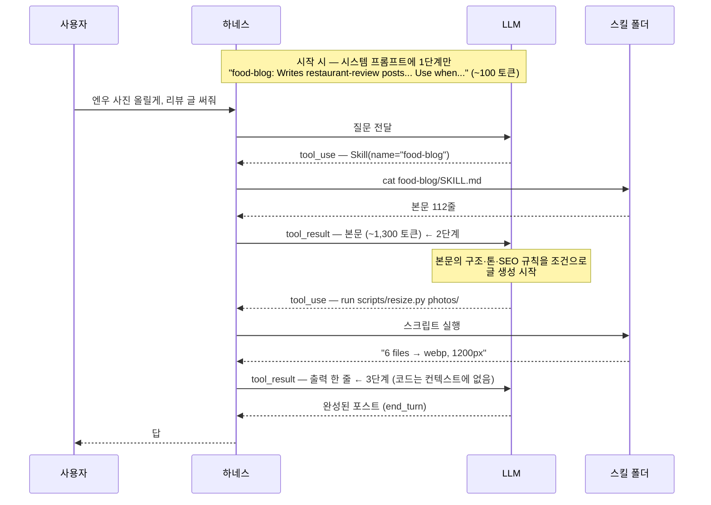
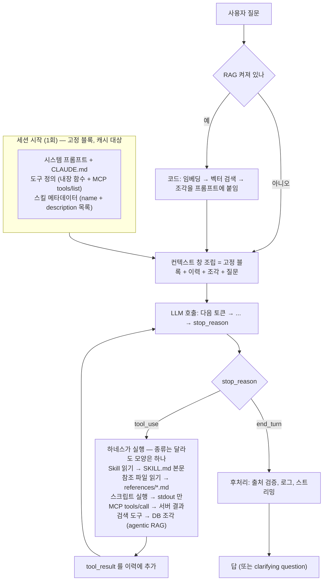

## 한 줄 요약

> **RAG는 코드가 자료를 골라 프롬프트에 push하고,  
Skills는 LLM이 metadata를 보고 필요한 매뉴얼을 스스로 pull한다.**   
Tool Use는 그 pull의 왕복 통로,   
MCP는 그 통로의 콘센트 규격.   
어느 서버의 도구든 같은 모양으로 꽂힌다.   
넷 다 LLM을 바꾸지 않는다.   
**컨텍스트 창에 무엇을, 누가, 언제 넣는가**만 다르다.
{: .prompt-tip }

[anthropics/skills](https://github.com/anthropics/skills) 저장소를 읽다가 걸렸다.   
[3편](/posts/rag-serving-path-how-llm-generates-answers-java-ruby/)에서 "질문 → DB에서 조각 검색 → 프롬프트에 붙임 → LLM이 생성"까지는 그림이 잡혔는데, 스킬은 이 그림 어디에 들어가는 물건인가.   
검색인가, 프롬프트인가, 도구인가.   
같이 자주 나오는 Tool Use, MCP도 마찬가지로 헷갈렸다.   
이 글은 그 넷을 하나의 그림 위에 놓는 용도.

---

## 0. 먼저 고정할 사실: LLM은 컨텍스트 외부를 못 본다

3편 결론을 한 줄로 다시 쓰면 `P(다음 토큰 | 컨텍스트 안의 모든 텍스트)`.   
LLM이 호출 한 번에 보는 건 컨텍스트의 토큰이 전부다.   
외부의 DB, 파일, API는 없는 것과 같다.   
그러니까 "LLM에게 뭔가를 알려주는" 장치는 전부 **컨텍스트에 텍스트를 넣는 방법**의 변형이다.   
이 글에서는 컨텍스트 창 안쪽을 **컨텍스트**, 거기 없어서 도구로 가져와야 하는 것(파일, DB, 실행 결과)을 **외부**라고 부른다.

컨텍스트는 보통 이런 층으로 쌓인다.

| 칸 | 들어 있는 것 | 누가 넣나 / 언제 |
|---|---|---|
| ① 시스템 프롬프트 | 고정 지시문, 역할, 규칙 | 개발자 작성, 시작 시 |
| ② 프로젝트 지침 | CLAUDE.md, 메모리 파일 | 시작 시 로드 |
| ③ 도구 정의 | 이름·설명·입력 스키마 (내장 + MCP) | 시작 시 로드 |
| ④ 스킬 메타데이터 | 스킬마다 name + description 한 줄 | 시작 시 로드 |
| ⑤ 대화 이력 | 이전 질문·답변 | 턴마다 누적 |
| ⑥ 검색된 자료 | RAG가 붙인 문서 조각 | 코드가, 매 질문마다 |
| ⑦ 도구 호출 + 결과 | tool_use → tool_result 쌍. 스킬 본문(SKILL.md), 참조 파일, 스크립트 출력도 여기로 들어온다 | 하네스가, 루프마다 |
| ⑧ 이번 질문 | 사용자 입력 | 매 턴 |

```
①~⑧ 전부 ─▶ LLM: 다음 토큰 확률 → 하나 뽑기 → 반복
```

①~④는 세션 열릴 때 한 번 들어가고 거의 안 바뀐다(캐시 대상).   
⑤~⑧은 턴마다 늘어난다.   
이 글의 네 주인공은 전부 **이 컨텍스트의 어느 칸을, 누가, 언제 채우는가**로 갈린다.

---

## 1. 예시 하나로 먼저: "내가 쓴 글 중에 한식, 중식이 각각 몇 개지?"

위 표만 보면 추상적이라, 질문 하나를 턴 단위로 따라간다.   
내가 처음에 그렸던 그림은 이랬다.   
"질문과 스킬 같은 걸 컨텍스트에 전부 넣는다 → LLM이 Tool Use로 뭘 할지 정한다 → 정 안 되면 사용자에게 clarifying question을 한다 → 의문이 다 풀리면 답한다."   
반은 맞고 반은 틀렸다.

이 질문을 고른 이유는 **답이 컨텍스트에 없기 때문**이다.   
모델 가중치에도 없다(내 블로그를 학습한 적이 없다, 1편 1장).   
그래서 "외부"이 뭔지, 도구와 스킬이 왜 끼어드는지가 바로 드러난다.   
숫자는 이 블로그의 실제 글로 센 값이다.

### 1-1. 턴 1: 컨텍스트에 뭐가 들어가나

| 칸 | 턴 1에 들어 있는 것 | 토큰 |
|---|---|---|
| ① 시스템 프롬프트 | "너는 이 블로그 저장소에서 일하는 어시스턴트다. 모호하면 묻고, 한국어로 답해라." | 200 |
| ③ 도구 정의 | `read_file` / `bash` / `write_file` (이름·설명·스키마) | 600 |
| ④ 스킬 metadata | `food-blog`: 식당 리뷰 글 작성. 사진 올리면 사용. | 100 |
| ⑤ 대화 이력 | 없음 (첫 질문) | 0 |
| ⑧ 질문 | "내가 쓴 글 중에 한식, 중식이 각각 몇 개지?" | 30 |

스킬은 **한 줄 metadata만** 들어가 있다.   
본문(SKILL.md)은 없다.   
도구도 **정의만** 있다.   
실행된 건 아무것도 없다.   
그리고 컨텍스트 어디에도 글 목록은 없다.   
이 상태로 LLM을 한 번 호출한다.

### 1-2. 생성: "답이 컨텍스트에 없다"는 판단은 토큰으로 한다

호출이 들어가면 3편 3장의 일이 벌어진다.   
다음 토큰 확률 계산, 하나 뽑기, 반복.   
이 과정에서 모델이 "정하는" 것들이 있다.

| 정할 것 | 근거 | 결론 |
|---|---|---|
| 답을 아는가 | 컨텍스트에 글 목록 없음. 가중치에도 없음 | 모른다. 그냥 답하면 지어내는 것(3편 2장의 환각) |
| 어디서 가져오나 | 도구 정의에 `bash`가 있음 | `_posts/*.md`의 frontmatter를 읽으면 된다 |
| 뭘로 세나 | 1편에서 만든 frontmatter에 `categories`와 `tags`가 있음 | 일단 categories부터 |

이 "정하기"가 Tool Use가 아니라는 게 포인트.   
**생성 그 자체**다. thinking이 켜져 있으면 답 앞에 생각 토큰을 몇백 개 뽑으면서 고민하고, 꺼져 있으면 바로 다음 토큰에서 정한다.   
도구는 그 판단의 **결과**로 나온다.   
판단의 내용이 "외부에서 가져와야 한다"일 때만.

"외부"은 컨텍스트의 텍스트만으로는 못 하는 일 전부다.   
세 종류.

| 외부의 일 | 예 | 이 질문에서 |
|---|---|---|
| **읽기** | 파일, DB, 검색, API, 현재 시각 | `_posts/*.md` 읽기. **필요** |
| **실행** | 스크립트 돌려서 출력 보기, 테스트 | 집계 스크립트가 있으면 (1-5) |
| **쓰기** | 파일 저장, 커밋, 메시지 전송 | 없음 |

비교를 위해, 도구 정의가 하나도 없는 순수 챗이면 이 호출은 이렇게 끝난다.

```
"제 블로그 글을 볼 수 없어서 셀 수 없습니다."     ← 정직한 쪽
"한식 7개, 중식 3개입니다."                      ← 환각. 0장이 말한 그것
```

둘 다 텍스트이고 `end_turn`.   
외부로 나갈 통로가 없으니 루프도 없다.

### 1-3. 도구 루프: tool_use → 하네스 실행 → tool_result

도구가 있으니 이번엔 출력이 텍스트가 아니라 `tool_use` 블록이다.   
하네스가 실행하고 결과를 컨텍스트에 넣고 다시 호출한다.

```
호출 1  → tool_use  bash(cmd="grep -h '^categories:' _posts/*.md | sort | uniq -c | sort -rn")
          하네스: 실행 → tool_result
                   14 categories: [Dev, Design Pattern]
                   10 categories: [Korean Food, Seoul]
                    1 categories: [Korean Food, Anyang]
                    6 categories: [Dev, Spring]  ...        (중식 카테고리는 없음)

호출 2  → tool_use  bash(cmd="grep -H -m1 '^tags:' $(grep -l 'Korean Food' _posts/*.md)")
          하네스: 실행 → tool_result (11줄)
                   sundae-silrok:      [sundaeguk, gukbap, korean-food, ...]
                   evergreen-donkatsu: [donkatsu, pork-cutlet, korean-food, ...]
                   gwangneung-ok:      [korean-bbq, banchan, korean-food, ...]
                   gyehyanggak:        [chinese-restaurant-seoul, pagoda-pork, ...]
                   central-reducer:    [chinese-italian-fusion, seongsu, ...]
                   kanda-soba, enwoo:  japanese-food   miette: italian   stay-seoul: french-cuisine ...

호출 3  → 텍스트   (아래 1-4)                                                    end_turn
```

호출마다 컨텍스트가 커진다.   
호출 2의 컨텍스트에는 호출 1의 `tool_use`와 결과가 그대로 들어 있고, 모델은 그걸 읽고 다음 명령을 쓴다.   
모델이 한 일은 매번 "다음에 할 일을 JSON으로 쓰기"였고, grep을 돌린 건 전부 하네스다.

그리고 결과를 읽은 모델이 애매한 걸 발견한다.   
카테고리로 세면 음식 글 11개가 **전부** `Korean Food`라 중식은 0이다.   
태그로 세면 `korean-food`가 3, 중식이 2인데 그중 하나(중앙감속기)는 중식·이탈리안 퓨전이다.   
기준을 정해야 답이 달라진다.

### 1-4. clarifying question은 도구 호출이 아니라 그냥 답변이다

내가 틀렸던 부분.   
"정 안 되면 질문한다"를 도구 호출이 실패한 뒤의 fallback처럼 생각했는데, 아니다.   
호출 3의 출력은 **텍스트 답변**이다.

```
"카테고리로 세면 음식 글 11개가 전부 Korean Food라 한식 11, 중식 0입니다.
 태그로 세면 한식(korean-food) 3, 중식 2인데 그중 중앙감속기는 중식·이탈리안 퓨전입니다.
 어느 기준으로 셀까요? 퓨전은 중식에 넣을까요?"                                  end_turn
```

모델은 질문 문장을 토큰으로 뽑고 `end_turn`으로 턴을 끝낸다.   
하네스는 그걸 사용자에게 보여주고 **멈춘다.**   
루프도 없고 도구도 없다. clarifying question이냐 가정하고 답하느냐는 시스템 프롬프트("모호하면 묻고")와 결과의 애매함이 조건부 확률을 어느 쪽으로 기울이느냐의 문제고, 보장은 없다.

> Claude Code는 clarifying question을 `AskUserQuestion`이라는 도구로 하기도 한다.   
> 모양은 `tool_use`지만 하는 일은 같다.   
> 턴을 멈추고 사용자 입력을 기다린다.   
> 선택지를 버튼으로 보여주려고 도구 형태를 빌린 것뿐이다.
{: .prompt-info }

사용자가 "태그 기준.   
퓨전도 중식에 넣어."라고 답하면 턴 2의 컨텍스트는 이렇게 된다.

| 칸 | 턴 2에 들어 있는 것 | 토큰 |
|---|---|---|
| ① ③ ④ | 턴 1과 동일 (캐시 히트) | 900 |
| ⑤ 대화 이력 | user: "내가 쓴 글 중에 한식, 중식이 각각 몇 개지?"<br>assistant: tool_use bash(...) · user: tool_result (카테고리 집계)<br>assistant: tool_use bash(...) · user: tool_result (태그 11줄)<br>assistant: "어느 기준으로 셀까요? ..." | 1,200 |
| ⑧ 질문 | user: "태그 기준. 퓨전도 중식에 넣어." | 15 |

모델은 턴 1을 **기억하지 않는다.**   
이력(도구 결과 포함)이 컨텍스트에 다시 들어가서 이어지는 것처럼 보일 뿐이다.   
이번엔 다시 grep 할 필요가 없다.   
태그 11줄이 이미 컨텍스트에 있으니까.

```
호출 4  → 텍스트   "한식 3 (순대실록, 에버그린 돈까스, 광릉옥), 중식 2 (계향각, 중앙감속기)"   end_turn
```

여기까지 LLM 호출 4번, 도구 호출 2번, 스킬 본문 로드 0번.

### 1-5. 같은 질문에 스킬이 있는 경우

clarifying question이 생긴 이유는 "한식·중식을 어떻게 세는가"라는 **규칙**이 컨텍스트 어디에도 없어서다.   
이 규칙을 매번 대화로 알려주기 싫으면 스킬로 만든다.

```
blog-stats/
├── SKILL.md            name: blog-stats
│                       description: 글 개수·카테고리·태그 집계. 블로그 통계 질문에 사용.
│                       본문: 음식 글은 categories 첫 값이 Korean Food (요리 종류와 무관).
│                             요리 종류는 tags로 센다. 한식 = korean-food, 중식 = chinese-* (퓨전 포함).
│                             집계는 scripts/count.py 를 실행한다.
└── scripts/count.py    frontmatter 읽어서 태그별 개수 출력
```

턴 1의 ④ 스킬 metadata에 `blog-stats: 글 개수·카테고리·태그 집계.   
블로그 통계 질문에 사용.`   
한 줄이 추가된 것 말고는 컨텍스트가 같다.   
생성 중에 "블로그 통계 질문"이 지금 질문과 맞는다.

```
호출 1  → tool_use  Skill(name="blog-stats")                                      ← 2단계
          하네스: cat skills/blog-stats/SKILL.md → tool_result (본문 30줄)
호출 2  → tool_use  bash(cmd="python skills/blog-stats/scripts/count.py")        ← 3단계
          하네스: 실행 → tool_result  "korean-food 3 / chinese 2 (fusion 1) / japanese 2 / italian 1 ..."
호출 3  → 텍스트   "한식 3, 중식 2 (퓨전 1 포함)"                                   end_turn
```

clarifying question이 사라졌다.   
분류 기준이 본문에 있으니까.   
스킬 본문이 "사실"이 아니라 **"절차와 규칙"**이라는 게 이 뜻이다.   
`count.py`의 코드는 컨텍스트에 안 들어갔다.   
출력 한 줄만 들어갔다.   
스킬이 "쓰인" 시점은 본문이 `tool_result`로 컨텍스트에 들어온 순간이고, 그 전까지 컨텍스트에 있던 건 한 줄 metadata뿐이다.   
`food-blog` 스킬은 끝까지 한 줄로만 남았다.

### 1-6. 같은 질문을 RAG, MCP로 풀면

**RAG만 있으면 못 푼다.**   
코드가 "한식 중식 개수"를 임베딩 → `post_chunks`에서 상위 5개 조각(계향각 본문 조각, 순대실록 조각, ...) → 프롬프트에 붙임 → LLM 호출 1번 → "한식 2, 중식 2".   
5조각만 보고 센 답이다.   
글 11개 전체를 본 적이 없다.   
유사도 검색은 "관련 있는 몇 개"를 찾는 도구지 "전부 세는" 도구가 아니다.   
세는 건 1편의 Frontmatter 컬럼에 `GROUP BY` 하는 일이다.

**RAG에 `sql` 도구를 주면 풀린다**(agentic RAG).   
LLM이 `SELECT tag, COUNT(*) ... GROUP BY tag`를 써서 보내고, 결과를 읽고 답한다.   
호출 2번.

**MCP는 도구의 출처만 다르다.**   
Postgres MCP 서버가 `query` 도구를, 파일시스템 MCP 서버가 `read_file` 도구를 공급한다.   
하네스는 `tools/list`로 받은 정의를 ③에 넣는다.   
그 뒤는 1-3과 같은 루프다.

| 구성 | 흐름 | LLM 호출 | 도구 호출 | 답 |
|---|---|---|---|---|
| 순수 챗 (도구 없음) | 컨텍스트에 답이 없다 | 1 | 0 | "볼 수 없다" 또는 환각 |
| Tool Use (`bash`) | 읽기 2번 → clarifying question → 턴 2 답 | 4 | 2 | 한식 3, 중식 2 |
| + Skill (`blog-stats`) | 본문 읽기 → 스크립트 → 답 | 3 | 2 | 한식 3, 중식 2. clarifying question 없음 |
| RAG만 | 상위 5조각으로 셈 | 1 | 0 | 틀림. 전체를 안 봄 |
| RAG + `sql` 도구 | `GROUP BY` 1번 → 답 | 2 | 1 | 맞음 |
| MCP (Postgres 서버) | 위와 같음. 도구 공급처만 다름 | 2 | 1 | 맞음 |

### 1-7. 내가 처음 그린 그림과 실제

| 내가 그린 그림 | 실제 |
|---|---|
| "질문과 스킬을 컨텍스트에 전부 넣는다" | 질문은 들어간다. 스킬은 **한 줄 metadata만** 들어가고, 본문은 LLM이 pull할 때만 들어간다 |
| "LLM이 Tool Use로 뭘 할지 정한다" | 정하는 건 **생성(토큰)** 자체다. "답이 컨텍스트에 없다, 파일을 읽어야 한다"는 판단이 먼저고, 도구는 그 뒤에 나온다. 외부(읽기·실행·쓰기)이 필요 없는 질문은 도구 0번 |
| "정 안 되면 질문한다" | clarifying question은 **텍스트 답변**이다. `end_turn`으로 턴이 끝나고 하네스가 사용자를 기다린다 |
| "의문이 다 풀리면 답한다" | 단계가 따로 없다. 호출 한 번의 결과는 텍스트(답 또는 clarifying question) 아니면 `tool_use`, 둘 중 하나. `tool_use`일 때만 루프 |

이 네 줄이 잡히면 나머지 장은 "어느 칸에 누가 뭘 넣나"의 각론이다.

---

## 2. 네 장치를 한 표로

| 장치 | 컨텍스트에 넣는 것 | 넣을지 **누가** 정하나 | **언제** | 개발자 비유 |
|---|---|---|---|---|
| RAG | 검색된 문서 조각 (⑥) | **코드** (임베딩 + DB 유사도) | 매 질문, LLM 호출 **전** | `SELECT` 결과를 뷰에 바인딩 |
| Tool Use | 도구 정의 (③) + 실행 결과 (⑦) | 정의는 개발자, **호출은 LLM** | 정의: 시작 시 / 결과: LLM이 부를 때 | 인터페이스 선언 + 런타임 호출 |
| MCP | Tool Use와 같음. 도구를 **외부 서버**가 공급 | 서버가 목록 제공, LLM이 호출 | 같음 | JDBC 드라이버 |
| Skills | 1단계 메타(④) → 2단계 SKILL.md 본문(⑦) → 3단계 참조 파일·스크립트 출력(⑦) | **LLM** | 1단계 시작 시, 2·3단계는 필요할 때 | `FetchType.LAZY` |

세 번째 열이 핵심.   
RAG만 **코드**가 고르고 나머지는 **LLM**이 고른다.   
그래서 RAG는 LLM 호출이 한 번이고 나머지는 루프가 된다.

---

## 3. RAG: 코드가 push한다

3편 그대로.   
복습만 짧게.

```
질문 ─▶ [코드] 임베딩 → pgvector 검색 → 상위 5개 조각 → 프롬프트 조립 ─▶ [LLM] 생성 ─▶ 답
                                                                      (호출 1회)
```

1-6에서 봤듯 "한식, 중식 몇 개?"를 RAG에 넣으면 코드가 "한식 중식 개수"를 임베딩 → `post_chunks`에서 상위 5개 → 프롬프트에 붙임 → LLM 호출 1번 → 5조각만 보고 센 답.   
LLM은 자료가 어디서 왔는지 모르고, 더 달라고 할 수도 없다.   
조각 5개가 전부가 아니어도 그걸로 답을 만든다.   
반대로 "계향각 글에서 뭐가 제일 맛있다고 했지?"   
같은 질문은 RAG가 딱 맞는다.   
관련 조각 몇 개만 있으면 되니까.

장점은 **결정적**이고(같은 질문이면 같은 조각), **싸고**(LLM 1회), **문서가 수만 개여도** 된다(벡터 인덱스가 고른다).   
단점은 질문 하나에 "검색 한 번"이라는 모양이 고정이라, "metadata 보고 → 3장 읽고 → 모르면 부록" 같은 **탐색**이 안 된다는 것.

---

## 4. Tool Use: LLM은 호출문을 쓰고, 코드가 실행한다

탐색을 하려면 LLM이 "자료를 더 달라"고 말할 수 있어야 한다.   
그게 Tool Use(function calling).   
1-3의 `bash` 두 번 흐름이 이거다.   
구조는 다섯 줄.

1. 개발자가 **도구 정의**(이름, 설명, 입력 JSON 스키마)를 요청에 같이 보낸다.   
   이것도 토큰(③).
2. LLM이 답 대신 **`tool_use` 블록**을 출력한다.   
   어느 도구를 어떤 인자로 부르고 싶다는 JSON.   
   `stop_reason`은 `tool_use`.
3. **하네스**(내 코드)가 그 JSON을 읽고 실제 함수를 실행한다.
4. 결과를 **`tool_result` 블록**으로 `user` 메시지에 넣고 다시 호출한다(⑦).
5. `end_turn`이 나올 때까지 2~4 반복.



3편 용어로 보면 **`tool_use` 블록도 "다음 토큰"으로 만들어진 텍스트다.**   
LLM은 함수를 실행하지 않는다.   
함수 호출문처럼 생긴 JSON을 뽑고 멈춘다.   
실행은 전부 하네스.   
하네스가 없으면 Tool Use는 "함수 이름 적힌 JSON 한 줄"로 끝난다.

| | RAG | Tool Use |
|---|---|---|
| LLM 호출 횟수 | 1회 | N회 (루프) |
| 자료 선택 주체 | 코드 | LLM |
| 지연·비용 | 예측 가능 | 루프 횟수에 비례 |
| 잘 맞는 경우 | 문서 수만 개 중 관련 조각 찾기 | 탐색, 조건 분기, 여러 소스 조합 |

둘은 배타적이지 않다.   
검색 자체를 도구로 주면(`search_docs(query)`) LLM이 **언제, 어떤 검색어로** 찾을지 정한다.   
이걸 agentic RAG라고 부른다.   
3편의 ②~⑤ 단계가 통째로 도구 하나가 되는 셈.

---

## 5. MCP: 도구를 "어디서 가져오는가"의 표준

4장에서 도구 정의와 실행 함수는 내 코드 안에 있었다.   
Slack 메시지 보내기, GitHub 이슈 만들기, 사내 DB 조회 같은 도구를 전부 내가 짜야 한다.   
MCP(Model Context Protocol)는 그 부분을 **외부 서버로 떼어내고, 서버와 대화하는 방법을 표준화**한 것.

```
                      tools/list  ─────▶  "도구 목록 주세요"
 하네스 (MCP 클라이언트)  ◀─────────────  [{name, description, input_schema}, ...]
        │             tools/call  ─────▶  "list_pull_requests 를 이 인자로 실행"
        │                         ◀─────  결과
        │
        └─ 받은 목록을 그대로 LLM 요청의 ③ 도구 정의에 넣는다
           LLM이 tool_use 를 내면 tools/call 로 넘긴다

 MCP 서버: GitHub 서버 / Slack 서버 / Postgres 서버 / 사내 API 서버 ... (각자 구현)
```

예시.   
GitHub MCP 서버를 붙이고 "어제 머지된 PR 목록 알려줘"라고 물으면:

```
시작 시   하네스 → GitHub 서버: tools/list
          서버 → 하네스: list_pull_requests, create_issue, get_file, ... (도구 30개 정의)
          하네스: 30개를 ③ 도구 정의에 넣고 세션 시작

호출 1    LLM → tool_use list_pull_requests(state="closed", since="2026-09-30")
          하네스 → GitHub 서버: tools/call  → 결과 JSON → tool_result
호출 2    LLM → 텍스트 "어제 머지된 PR은 3건입니다. #412 ..."  end_turn
```

LLM 입장에서는 4장과 **완전히 같다.**   
도구 정의가 컨텍스트에 있고, `tool_use`를 내면 결과가 돌아온다.   
그 도구가 내 코드 안의 함수인지 네트워크 건너편 서버인지 LLM은 모른다.   
바뀐 건 하네스 쪽이다.   
함수 구현 대신 프로토콜 클라이언트를 갖고, 설정 파일에 서버 한 줄 추가하면 도구가 늘어난다.

비유는 JDBC.   
애플리케이션은 `Connection`과 `Statement`만 알고 MySQL이든 Postgres든 드라이버가 뒤에서 처리한다.   
MCP도 하네스는 프로토콜만 알고 GitHub든 Slack이든 서버가 뒤에서 처리한다.   
표준이라 서버를 한 번 만들면 Claude Code, claude.ai, Cursor 어디서든 붙는다.

> 주의할 점 하나.   
> **도구 정의도 토큰이다.**   
> 위 예시에서 GitHub 서버 하나가 도구 30개를 줬다.   
> 서버 10개면 300개.   
> 설명과 스키마만으로 수만 토큰이 ③에 상주한다.   
> 그래서 "도구 정의를 미리 다 넣지 말고 검색해서 필요한 것만 로드"하는 tool search 같은 장치가 나왔다.   
> 이 문제의식이 다음 장 Skills의 설계 그대로다.
{: .prompt-warning }

---

## 6. Skills: LLM이 스스로 pull하는 매뉴얼

### 6-1. 실체는 폴더 하나

[스펙](https://agentskills.io/specification)이 정한 건 이게 전부다.

```
food-blog/
├── SKILL.md          # 필수. YAML frontmatter(name, description) + 마크다운 지시문
├── scripts/          # 선택. 실행할 코드 (python, bash, ...)
├── references/       # 선택. 필요할 때만 읽을 긴 문서
└── assets/           # 선택. 템플릿, 이미지, 스키마
```

```markdown
---
name: food-blog
description: Writes English restaurant-review posts for this Jekyll blog in the house style. Use when the user uploads restaurant photos or asks for a food/restaurant review post.
---

# Food Blog Post Skill
## Voice & Tone ...
## Post Structure ...
```

`name`은 64자 이내 소문자·숫자·하이픈, `description`은 1,024자 이내.   
스펙이 반복해서 강조하는 건 description에 **"무엇을 하는지"와 "언제 쓰는지"를 둘 다** 쓰라는 것.   
1-5에서 `blog-stats`가 꺼내진 이유가 "블로그 통계 질문에 사용"이라는 한 줄이었다.

실제로 이 블로그의 `.claude/skills/food-blog/SKILL.md`를 열어 봤다.   
112줄, 5.3KB, 토큰으로 1,300개 안팎.   
그런데 frontmatter가 없었다.   
이러면 하네스는 폴더명을 name으로, 첫 제목 줄 "Food Blog Post Skill"을 description으로 대신 쓴다.   
"언제 쓰는지"가 비어 있으니 LLM이 이 스킬을 꺼낼 단서가 약하다.   
이 글 쓰면서 알게 된 숙제.

### 6-2. 3단계 점진적 공개 (progressive disclosure)

스킬의 핵심 설계는 **한 번에 다 넣지 않는다**는 것.   
공식 문서가 세 단계로 나눈다.

| 단계 | 컨텍스트에 들어가는 것 | 언제 | 토큰 |
|---|---|---|---|
| **1. 메타데이터** | `name` + `description` | 세션 시작 시, **모든 스킬** | 스킬당 ~100 |
| **2. 지시문** | `SKILL.md` 본문 전체 | LLM이 "이 스킬이 맞다"고 판단해 **읽을 때** | 5,000 미만 권장 (500줄 이내) |
| **3. 자원** | `references/*.md` 내용, `scripts/*` **출력** | 본문이 가리키고, 지금 작업에 **필요할 때** | 읽기 전까지 0 |

1단계는 **metadata**.   
컨텍스트에 상주하지만 한 줄이라 스킬 50개를 깔아도 5,000토큰이다.   
2단계는 **본문**.   
LLM이 metadata를 보고 도구 호출(Claude Code에서는 `Skill` 도구, API에서는 컨테이너 안에서 `cat SKILL.md`)로 pull한다.   
3단계는 **부록**.   
본문이 "폼 채우기는 `FORMS.md` 참고"라고 써 두면 폼 작업일 때만 그 파일을 읽는다.   
스크립트는 더 극단적이다.   
**코드는 컨텍스트에 안 들어가고 실행 결과(stdout)만 들어간다.**

food-blog 스킬이 제대로 된 frontmatter를 갖췄다고 치고, 1장과 같은 식으로 따라가면 이렇다.



여기서 RAG와의 관계가 보인다.   
**스킬은 "검색"을 LLM의 판단에 맡긴 RAG다.**   
검색 키는 description, 검색기는 LLM 자신의 어텐션(3편 3-3), 검색 결과는 SKILL.md.   
다만 후보가 수십 개라서 **metadata를 전부 컨텍스트에 넣을 수 있다.**   
후보가 수만 개면 못 넣고, 그때 벡터 인덱스가 필요하다.   
**후보의 개수가 push와 pull을 가른다**가 포인트.

| | RAG | Skills |
|---|---|---|
| 후보 수 | 수천~수백만 조각 | 수십~수백 개 |
| metadata를 컨텍스트에 넣을 수 있나 | 불가 → 벡터 인덱스 | 가능 → description 한 줄씩 |
| 선택 주체 | 코드(유사도 Top-K) | LLM(설명 읽고 판단) |
| 내용의 성격 | **사실**(문서, 데이터) | **절차**(워크플로, 규칙, 스크립트) |
| 갱신 | `INSERT` | 파일 수정 |

마지막 행이 실무에서 중요하다.   
"우리 회사 2024년 매출"은 RAG고, "우리 회사 보고서는 이 형식으로 이 스크립트 돌려서 만든다"는 스킬이다.

### 6-3. 비유: Lazy loading

JPA에서 `@ManyToOne(fetch = FetchType.LAZY)`를 걸면 연관 객체는 **ID만 든 프록시**로 들어오고, 실제 필드에 접근하는 순간 `SELECT`가 나간다.   
Rails도 `post.author`를 부르기 전엔 쿼리가 없다.   
스킬의 1단계가 프록시(이름·설명), 2단계가 실제 로딩.   
스킬 수십 개를 깔아도 N+1처럼 전부 로드되지 않는 이유.

리눅스 `man`도 같은 구조다.   
`man -k pdf`는 이름과 한 줄 설명만 뒤지고(1단계), `man pdftotext`가 본문을 열고(2단계), 본문 끝 SEE ALSO가 다른 페이지를 가리킨다(3단계).   
스킬 저장소는 LLM용 man 페이지 모음이라고 보면 거의 맞다.

### 6-4. 세 환경에서의 차이

같은 폴더가 환경마다 조금 다르게 실린다.

| | Claude Code | Claude API | claude.ai |
|---|---|---|---|
| 스킬 위치 | `~/.claude/skills/`, `.claude/skills/`, 플러그인 | `/v1/skills`에 업로드 → `container.skills`로 지정 | 설정에서 zip 업로드 |
| 1단계 주입 | 시스템 프롬프트에 목록 (예산: 컨텍스트의 1%) | 컨테이너에 마운트, 목록은 시스템 프롬프트 | 자동 |
| 2단계 읽기 | `Skill` 도구 호출 또는 사용자가 `/food-blog` | Claude가 bash로 `cat SKILL.md` | 자동 |
| 스크립트 실행 | 내 컴퓨터에서 (네트워크 있음) | 샌드박스 컨테이너 (네트워크 없음) | 설정에 따라 |
| 한 번 읽은 본문 | 메시지로 1회 삽입, 이후 턴에 유지(재읽기 없음) | 대화 이력에 남음 | — |

API 쪽은 요청 모양만 보면 된다.   
스킬은 **코드 실행 도구의 컨테이너 안에 깔리는 파일**이다.

```bash
curl https://api.anthropic.com/v1/messages \
  -H "x-api-key: $ANTHROPIC_API_KEY" \
  -H "anthropic-version: 2023-06-01" \
  -H "anthropic-beta: code-execution-2025-08-25" \
  -H "content-type: application/json" \
  -d '{
    "model": "claude-opus-5-5",
    "max_tokens": 4096,
    "container": { "skills": [ { "type": "custom", "skill_id": "skill_01...", "version": "latest" } ] },
    "tools": [ { "type": "code_execution_20250825", "name": "code_execution" } ],
    "messages": [ { "role": "user", "content": "엔우 리뷰 글 써줘" } ]
  }'
```

Claude Code에는 frontmatter 옵션이 몇 개 더 있다.   
`disable-model-invocation: true`면 LLM이 알아서 못 꺼내고 사용자가 `/이름`으로만 부를 수 있다(배포 같은 위험한 절차용).   
`allowed-tools`는 스킬이 쓰는 도구를 미리 허용.   
`context: fork`는 본문을 별도 서브에이전트의 프롬프트로 넘겨서 **내 대화 이력을 안 보는** 상태로 돌린다.

### 6-5. 스크립트: 토큰 대신 CPU

스킬에 스크립트를 넣는 이유를 공식 글이 한 문장으로 쓴다.   
리스트 정렬을 토큰 생성으로 하는 건 정렬 알고리즘을 실행하는 것보다 훨씬 비싸다.   
3편 3-8의 비용 표 그대로다.   
LLM이 이미지 6장 리사이즈 코드를 매번 새로 쓰면 출력 토큰 수백 개 + 틀릴 가능성이고, `scripts/resize.py`를 실행하면 입력 한 줄(명령)과 출력 한 줄(결과)이다.   
**결정적이어야 하는 작업은 스크립트로, 판단이 필요한 작업은 지시문으로.**   
스킬 작성 가이드의 기본 원칙.

---

## 7. 전체 그림: 질문 하나가 답이 되기까지

네 장치를 한 번에 그린다.   
1장의 예시는 이 그림에서 RAG 없이 `tool_use` 가지를 두 번 돌고, clarifying question으로 `end_turn`, 사용자 답을 받은 턴 2가 다시 `Q`에서 시작해 답으로 나간 경우다.



읽는 법.

- **'세션 시작' 상자**는 세션에 한 번 들어가는 고정 블록.   
  도구 정의와 스킬 metadata가 여기 있다.   
  캐시하면 싸진다.
- **RAG**는 LLM 호출 **앞**에 끼어드는 코드 단계.   
  조각을 붙이고 끝.
- **Tool Use 루프**는 LLM 호출 **뒤**에서 돈다.   
  스킬 본문 읽기, 참조 파일 읽기, 스크립트 실행, MCP 호출, 검색 도구.   
  종류는 달라도 전부 "`tool_use` 내고 → 하네스가 실행 → `tool_result`로 돌려받기" 한 모양이다.
- **clarifying question**는 `end_turn` 쪽으로 나간다.   
  루프가 아니다.   
  사용자가 답하면 다음 턴이 `Q`에서 다시 시작한다.
- **스킬은 이 루프 위에서 동작하는 규약**이다.   
  새로운 통로가 아니라 "metadata는 미리, 본문은 도구로, 부록은 더 필요하면"이라는 폴더 구조와 로딩 순서.

처음 질문에 답하면, 스킬은 RAG 그림의 "검색" 칸이 아니라 **"LLM이 도구를 부르는 루프" 칸**에 들어간다.   
그 루프가 읽어오는 게 문서 조각이 아니라 **절차 매뉴얼**일 뿐이다.

---

## 8. 직접 만들어 보기: 스킬을 읽는 최소 하네스

1장의 흐름을 코드로 확인하는 용도.   
할 일은 셋.

1. 시작 시 `skills/*/SKILL.md`를 스캔해 frontmatter의 `name`·`description`만 뽑아 시스템 프롬프트에 목록으로 넣는다(1단계).
2. 도구 세 개를 정의한다.   
   `read_skill(name)`은 본문(2단계), `read_skill_file(name, path)`는 참조 파일, `run_skill_script(name, path)`는 스크립트를 실행해 **출력만** 돌려준다(3단계).
3. 4장의 루프를 돈다.

앞선 세 편은 OpenAI 호출로 썼지만, 이 글 주제가 Anthropic 스킬이라 공식 Anthropic SDK로 쓴다.   
루프 모양은 어느 쪽이든 같다.

### Ruby

```ruby
require "anthropic"
require "yaml"

SKILLS_DIR = File.expand_path("skills", __dir__)

# ① 시작 시: 폴더 스캔 → 이름·설명만 (1단계)
INDEX = Dir.glob("#{SKILLS_DIR}/*/SKILL.md").map do |path|
  text = File.read(path)
  meta = text.start_with?("---") ? YAML.safe_load(text.split("---", 3)[1]) : {}
  { name: meta["name"] || File.basename(File.dirname(path)),
    description: meta["description"].to_s, path: path }
end

SYSTEM = <<~S
  너는 코딩과 블로그 운영을 돕는 어시스턴트다. 모호하면 묻고, 한국어로 답해라.
  아래 스킬 목록에서 작업과 맞는 스킬이 있으면 먼저 read_skill 로 본문을 읽고 그 지시에 따라라.

  <skills>
  #{INDEX.map { |s| "- #{s[:name]}: #{s[:description]}" }.join("\n")}
  </skills>
S

# ② 도구 정의: 이것도 토큰이다
TOOLS = [
  { name: "read_skill", description: "스킬의 SKILL.md 본문을 돌려준다 (2단계)",
    input_schema: { type: "object", properties: { name: { type: "string" } }, required: ["name"] } },
  { name: "read_skill_file", description: "스킬 폴더 안의 참조 파일을 돌려준다 (3단계). 예: references/seo.md",
    input_schema: { type: "object",
                    properties: { name: { type: "string" }, path: { type: "string" } },
                    required: ["name", "path"] } },
  { name: "run_skill_script", description: "스킬 폴더 안의 스크립트를 실행하고 출력만 돌려준다 (3단계). 예: scripts/count.py",
    input_schema: { type: "object",
                    properties: { name: { type: "string" }, path: { type: "string" } },
                    required: ["name", "path"] } }
]

def run_tool(tool, input)
  skill = INDEX.find { |s| s[:name] == input["name"] } or return "no such skill: #{input["name"]}"
  root  = File.dirname(skill[:path])
  case tool
  when "read_skill" then File.read(skill[:path])
  when "read_skill_file", "run_skill_script"
    file = File.expand_path(input["path"], root)
    return "path escapes skill dir" unless file.start_with?("#{root}/")           # 폴더 밖 접근 차단
    tool == "read_skill_file" ? File.read(file) : IO.popen(["python3", file], &:read)   # 스크립트는 출력만
  end
end

# ③ 루프
client   = Anthropic::Client.new
messages = [{ role: "user", content: ARGV.join(" ") }]

loop do
  res = client.messages.create(model: "claude-opus-5-5", max_tokens: 16_000,
                               system_: SYSTEM, tools: TOOLS, messages: messages)
  messages << { role: res.role, content: res.content }              # tool_use 블록 포함, 통째로 보존

  if res.stop_reason != :tool_use                                    # 답이든 clarifying question이든 여기서 끝
    puts res.content.select { |b| b.type == :text }.map(&:text).join
    break
  end

  results = res.content.grep(Anthropic::Models::ToolUseBlock).map do |b|
    { type: "tool_result", tool_use_id: b.id,
      content: run_tool(b.name, b.input.transform_keys(&:to_s)) }
  end
  messages << { role: "user", content: results }                     # 결과는 전부 한 user 메시지에
end
```

돌려보면 1장이 그대로 나온다.

```
$ ruby harness.rb "내가 쓴 글 중에 한식, 중식이 각각 몇 개야?"
# 1회차: stop_reason=tool_use  → read_skill(name="blog-stats")                    ← 2단계
# 2회차: stop_reason=tool_use  → run_skill_script(path="scripts/count.py")        ← 3단계 (출력만 컨텍스트에)
# 3회차: stop_reason=end_turn  → "한식 3, 중식 2 (퓨전 1 포함)"

$ ruby harness.rb "엔우 사진 6장 있어. 리뷰 글 초안 써줘"
# 1회차: stop_reason=tool_use  → read_skill(name="food-blog")                     ← 2단계
# 2회차: stop_reason=tool_use  → read_skill_file(path="references/seo.md")        ← 3단계 (본문이 가리킬 때만)
# 3회차: stop_reason=end_turn  → 포스트 출력

$ ruby harness.rb "오늘 뭐 먹지?"
# 1회차: stop_reason=end_turn  → 맞는 스킬 없음. 바로 답 (도구 0번)
```

### Java

```java
import com.anthropic.client.AnthropicClient;
import com.anthropic.client.okhttp.AnthropicOkHttpClient;
import com.anthropic.core.JsonValue;
import com.anthropic.models.messages.*;
import java.util.*;

Tool readSkill = Tool.builder()
    .name("read_skill")
    .description("스킬의 SKILL.md 본문을 돌려준다 (2단계)")
    .inputSchema(Tool.InputSchema.builder()
        .properties(Tool.InputSchema.Properties.builder()
            .putAdditionalProperty("name", JsonValue.from(Map.of("type", "string")))
            .build())
        .required(List.of("name"))
        .build())
    .build();
// readSkillFile, runSkillScript 도 같은 모양 (name, path)

AnthropicClient client = AnthropicOkHttpClient.fromEnv();
MessageCreateParams.Builder params = MessageCreateParams.builder()
    .model("claude-opus-5-5").maxTokens(16000L)
    .system(buildSystemPrompt(index))                 // ① 1단계 목록이 들어간 시스템 프롬프트
    .addTool(readSkill).addTool(readSkillFile).addTool(runSkillScript)   // ②
    .addUserMessage(question);

while (true) {                                        // ③
    Message res = client.messages().create(params.build());
    params.addMessage(res);                           // 응답을 이력에 통째로 (tool_use 블록 포함)

    if (res.stopReason().map(r -> !r.equals(StopReason.TOOL_USE)).orElse(true)) {
        res.content().forEach(b -> b.text().ifPresent(t -> System.out.println(t.text())));
        break;                                        // 답이든 clarifying question이든 여기서 끝
    }

    List<ContentBlockParam> results = new ArrayList<>();
    for (ContentBlock b : res.content()) {
        b.toolUse().ifPresent(tu -> {
            Map<String, String> args = tu._input().convert(Map.class);   // {"name": "...", "path": "..."}
            results.add(ContentBlockParam.ofToolResult(ToolResultBlockParam.builder()
                .toolUseId(tu.id())
                .content(runTool(tu.name(), args))
                .build()));
        });
    }
    params.addUserMessageOfBlockParams(results);      // 결과는 한 user 메시지에
}
```

이 60줄이 Claude Code가 스킬에 대해 하는 일의 뼈대다.   
실제 구현은 여기에 예산 관리(목록이 컨텍스트의 1% 넘으면 자름), 중복 로드 방지(같은 본문은 "이미 로드됨" 한 줄로 대체), 압축 후 재첨부, 권한 검사가 붙지만 구조는 같다.   
시스템 프롬프트에 metadata 한 줄, 도구 결과로 본문 한 덩이.   
그게 스킬의 전부다.

> 보안 경계 하나.   
> 스킬 본문은 LLM이 **지시로 읽는** 텍스트다.   
> 출처가 불분명한 스킬은 "데이터 유출하라"는 지시를 본문이나 스크립트에 숨길 수 있고, LLM은 그걸 따를 수 있다.   
> 공식 문서도 스킬 설치를 소프트웨어 설치처럼 다루라고 쓴다.   
> 위 코드의 `path escapes skill dir` 검사가 최소한의 울타리.
{: .prompt-warning }

---

## 9. 자주 하는 혼동

**"LLM이 Tool Use로 뭘 할지 정한다."** 정하는 건 생성이다.   
1-2에서 봤듯 "답이 컨텍스트에 없다, 파일을 읽어야 한다"는 판단은 토큰을 뽑으면서 하고, 도구는 그 판단 뒤에 나온다.   
외부의 읽기·실행·쓰기가 필요 없는 질문엔 안 나온다.   
도구 정의가 컨텍스트에 있다고 매번 쓰는 게 아니다.

**"clarifying question도 도구 호출이다."** 아니다. clarifying question은 `end_turn`으로 끝나는 텍스트다.   
하네스가 멈추고 사용자를 기다린다.   
Claude Code의 `AskUserQuestion`처럼 도구 모양을 빌린 경우에도 "턴을 멈추고 기다린다"는 건 같다.

**"스킬을 깔면 LLM이 그걸 학습한다."** 가중치는 1비트도 안 바뀐다. metadata 한 줄이 시스템 프롬프트에 들어가고, 필요할 때 본문이 도구 결과로 들어온다.   
세션이 끝나면 사라지고 다음 세션에 다시 들어간다.

**"스킬이 RAG를 대체한다."** 다른 문제를 푼다.   
후보가 수십 개이고 내용이 절차면 스킬, 후보가 수만 개이고 내용이 사실이면 RAG.   
둘을 같이 쓰는 게 보통이다.   
스킬 본문이 "매출 질문은 `search_sales` 도구로 찾아라"라고 지시하고, 그 도구가 RAG다.

**"MCP는 새로운 AI 기능이다."** 통신 규약이다.   
LLM이 보는 건 여전히 도구 정의와 `tool_result`.   
새로운 건 "도구를 서버로 떼어내 어디서든 꽂는다"는 배포 모델.

**"description은 대충 써도 LLM이 알아서 찾는다."** 1단계에서 LLM이 보는 건 description **한 줄뿐**이다.   
본문이 아무리 좋아도 그 한 줄에 "언제 쓰는지"가 없으면 안 꺼낸다.   
벡터 검색에서 임베딩 품질이 Recall을 좌우하듯, 스킬에서는 description이 Recall을 좌우한다.

**"SKILL.md에 전부 몰아 쓴다."** 2단계는 읽히는 순간 전부 토큰이다.   
500줄 넘기면 참조 파일로 쪼개고, 참조는 SKILL.md에서 **한 단계만** 건다.   
두 단계 건너 링크하면 LLM이 `head -100`으로 앞부분만 보고 넘어가는 일이 생긴다.

---

## 10. 정리: 치트시트

| 장치 | 한 줄 | 컨텍스트의 어느 칸 | 토큰 비용 | 틀리면 생기는 증상 |
|---|---|---|---|---|
| 시스템 프롬프트 / CLAUDE.md | 사람이 쓴 고정 지시 | ①② 시작 시 | 상주 | 모든 턴에 영향, 길면 매 턴 비용 |
| RAG | 코드가 검색해 push하는 사실 | ⑥ 호출 전 | 조각 수 × 크기 | 검색 틀리면 그럴듯한 오답 (3편) |
| Tool Use | LLM이 호출문을 쓰고 코드가 실행 | ③ 정의, ⑦ 결과 | 정의 상주 + 결과 | 루프 폭주, 가짜 인자 |
| MCP | 도구를 외부 서버에서 표준으로 공급 | Tool Use와 같음 | 서버 많으면 ③ 비대 | 도구 100개 상주, 이름 충돌 |
| Skills | LLM이 metadata 보고 pull하는 절차 매뉴얼 | ④ metadata 상주, ⑦ 본문·부록 | 100/스킬 + 읽을 때만 본문 | description 약하면 안 꺼냄, 본문 길면 비쌈 |

| 질문 | 답 |
|---|---|
| 누가 고르나 | RAG는 코드, 나머지는 LLM |
| LLM 호출 몇 번 | RAG 1번, 나머지 루프 |
| "정하기"는 어디서 | 생성 자체. 도구가 아님 |
| clarifying question은 뭔가 | `end_turn`으로 끝나는 텍스트. 루프 아님 |
| LLM이 바뀌나 | 전부 아니오. 컨텍스트 창의 내용만 바뀐다 |
| 스킬은 어디 들어가나 | "도구 루프" 칸. 읽어오는 게 문서 조각이 아니라 절차 매뉴얼 |

1편이 "무엇을 저장하나", 2편이 "언제 채우나", 3편이 "꺼내서 어떻게 답이 되나"였다면 이 글은 "꺼내는 주체가 코드에서 LLM으로 넘어가면 뭐가 달라지나"다.   
달라지는 건 컨텍스트를 채우는 순서와 주체.   
컨텍스트의 텍스트를 조건으로 토큰을 뽑는 LLM 자체는 네 편 내내 같았다.

---

## 참고

- [anthropics/skills — 공개 스킬 저장소](https://github.com/anthropics/skills)
- [Agent Skills 스펙 (agentskills.io)](https://agentskills.io/specification)
- [Equipping agents for the real world with Agent Skills — Anthropic Engineering](https://www.anthropic.com/engineering/equipping-agents-for-the-real-world-with-agent-skills)
- [Agent Skills 개요 — Claude Platform Docs](https://platform.claude.com/docs/en/agents-and-tools/agent-skills/overview)
- [스킬 작성 모범 사례](https://platform.claude.com/docs/en/agents-and-tools/agent-skills/best-practices)
- [Claude Code에서 스킬 쓰기](https://code.claude.com/docs/en/skills)
- [Model Context Protocol](https://modelcontextprotocol.io/)
- [1편: RAG · 벡터DB · Frontmatter 총정리](/posts/rag-vector-db-frontmatter-for-sql-java-ruby-developers/) · [2편: DAG · Airflow · StarRocks 총정리](/posts/dag-airflow-starrocks-data-pipeline-for-sql-java-ruby-developers/) · [3편: RAG 서빙 경로 8단계](/posts/rag-serving-path-how-llm-generates-answers-java-ruby/)
