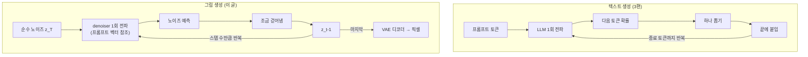
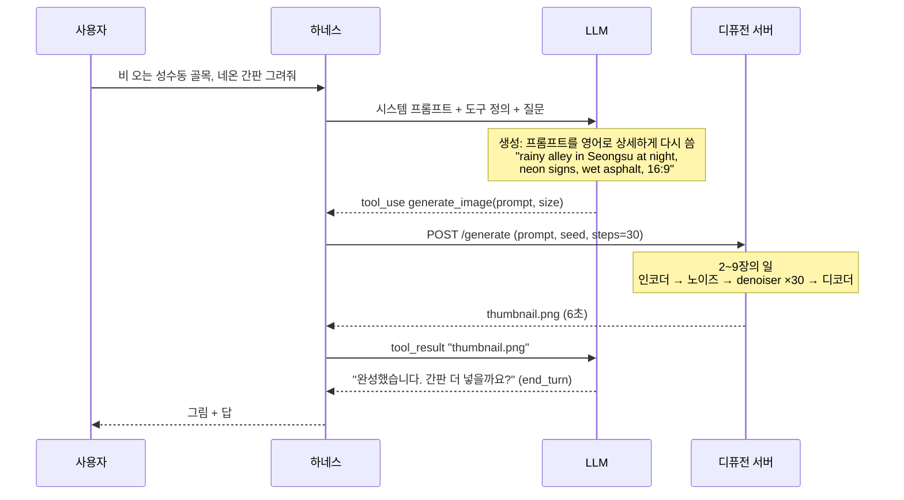
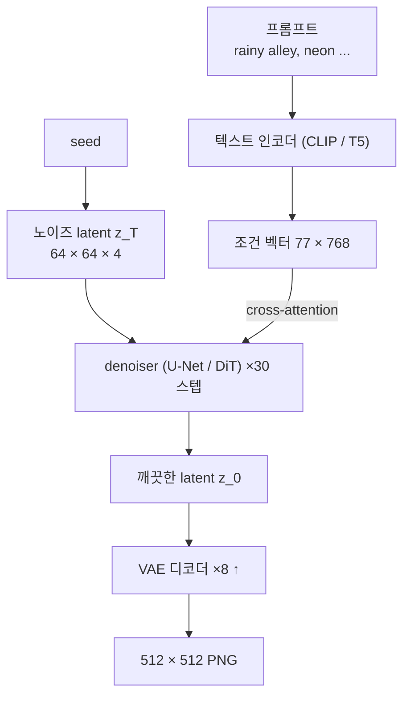
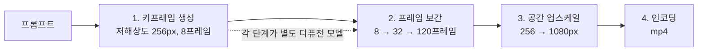

## 한 줄 요약

> **텍스트는 "다음 토큰 하나 뽑기"를 토큰 수만큼 반복하고, 그림은 "노이즈를 조금 걷어내기"를 수십 번 반복한다.**   
> 모델도 다르고 루프도 다르다.   
> 같은 건 하나다.   
> 둘 다 조건이 주어졌을 때의 확률을 학습해 두고 거기서 하나를 뽑는다.   
> 텍스트의 조건은 앞의 텍스트, 그림의 조건은 프롬프트다.   
> 그리고 채팅에서 LLM은 그림을 직접 그리지 않는다.   
> 4편의 "외부" 도구로 디퓨전 모델을 부른다.
{: .prompt-tip }

[4편](/posts/agent-skills-tool-use-mcp-vs-rag-how-llm-answers/)을 쓰고 나서 궁금해졌다.   
이렇게 텍스트로 답하는 거랑, 그림이나 영상은 또 어떻게 만드나.   
토큰을 뽑는 것과 픽셀을 만드는 건 전혀 다른 일 같은데 같은 "AI"라고 부른다.   
이 글은 그 질문에 답하는 용도.   
그림은 설명용으로 내가 블로그 사진(파르나스 빙수)을 Python으로 가공해 만들었다.   
실제 모델 내부 값이 아니라 개념도다.

---

## 0. 한 표로 먼저

| | 텍스트 (LLM) | 그림 (디퓨전) |
|---|---|---|
| 출력 단위 | 토큰 하나 | latent 이미지 한 장 전체 |
| 루프 1회가 하는 일 | 어휘 전체에 대한 확률 → 하나 뽑기 | "지금 이 그림에서 노이즈가 어느 부분인가" 예측 → 조금 걷어내기 |
| 루프 횟수 | 토큰 수 (수백~수천) | 스텝 수 (20~50, 증류 모델은 1~4) |
| 조건(프롬프트) 넣는 법 | 컨텍스트에 토큰으로 | 텍스트 인코더 벡터가 cross-attention으로 |
| 무작위성 parameter | temperature, top_p | seed, 스텝 수, CFG |
| 비용 결정자 | 토큰 수 | 해상도 × 스텝 수 (× 프레임 수) |
| 학습 때 맞히는 것 | 다음 토큰 | 섞여 있는 노이즈 |



왼쪽은 **하나씩 쌓는** 루프, 오른쪽은 **전체를 동시에 다듬는** 루프.   
이 차이가 뒤의 모든 차이를 만든다.

---

## 1. 예시 하나로 먼저: "중앙감속기 글 썸네일로, 비 오는 성수동 골목에 네온 간판 그림 그려줘"

4편 1장과 같은 방식으로 따라간다.   
컨텍스트에 뭐가 들어 있고, LLM이 뭘 하고, 누가 그리나.

| 칸 | 턴 1에 들어 있는 것 | 토큰 |
|---|---|---|
| ① 시스템 프롬프트 | "너는 이 블로그 저장소에서 일하는 어시스턴트다." | 200 |
| ③ 도구 정의 | read_file / bash / **generate_image(prompt, size)** | 700 |
| ⑤ 대화 이력 | 없음 | 0 |
| ⑧ 질문 | "중앙감속기 글 썸네일로, 비 오는 성수동 골목에 네온 간판 그림 그려줘" | 40 |

생성 중에 모델이 정하는 것.   
4편의 "외부" 표로 보면 이건 **쓰기**다.   
그림 파일은 토큰을 뽑아서 만들 수 없고, 외부의 다른 모델이 만들어야 한다.   
그래서 tool_use 블록이 나온다.



LLM이 한 일은 둘뿐이다.   
**프롬프트를 영어로 상세하게 다시 쓰기**(이건 토큰 생성), 그리고 **도구 호출문 쓰기**.   
그림을 그린 건 외부의 디퓨전 서버다.   
4편의 bash 호출과 모양이 같다.   
도구가 grep이냐 디퓨전 모델이냐만 다르다.

> 제품마다 다르다.   
> 이미지 생성 버튼이 있는 채팅 제품은 대개 이 구조(LLM + 별도 이미지 모델)다.   
> 최근 "네이티브 멀티모달" 모델은 도구 없이 같은 자기회귀 루프 안에서 이미지 토큰을 직접 뽑는다(8장).   
> 반대로 Claude는 문서 기준으로 그림을 **읽기만** 하고 생성은 안 한다(10장).
{: .prompt-info }

이제 디퓨전 서버 안으로 들어간다.

---

## 2. 디퓨전 파이프라인 한 장



부품이 넷이다.   
전부 별도 모델이고, 챗 LLM은 하나도 안 들어간다.

| 부품 | 입력 → 출력 | 하는 일 | 크기 |
|---|---|---|---|
| **텍스트 인코더** | 프롬프트 → 벡터 묶음 | 단어를 숫자로. 1편의 임베딩 모델과 같은 과목 | 수억 파라미터 |
| **VAE 인코더/디코더** | 픽셀 ↔ latent | 8배 압축·복원. 5장 | 수천만 |
| **denoiser** | (노이즈 섞인 latent, 스텝 t, 조건 벡터) → 노이즈 예측 | 핵심. 3·4장 | 수억~수십억 |
| **스케줄러** | 노이즈 예측 → 다음 latent | "얼마나 걷어낼지" 수식. 코드 몇 줄 | 0 (모델 아님) |

학습된 가중치는 denoiser에 있다.   
3편에서 LLM 가중치가 "다음 토큰"을 외운 것처럼, denoiser 가중치는 "노이즈 섞인 그림에서 노이즈가 어디인가"를 외우고 있다.

---

## 3. 학습: 사진에 노이즈를 더한다

디퓨전의 아이디어는 학습을 **거꾸로** 설계한 데 있다.   
노이즈에서 그림을 만드는 법을 직접 가르치는 게 아니라, 그림을 노이즈로 **망가뜨리는** 과정을 정해두고 그걸 되돌리게 시킨다.   
그 전에 "노이즈"가 정확히 뭔지부터.

### 3-1. 노이즈가 뭔가

사진은 픽셀마다 숫자 세 개(R, G, B, 각 0~255)다.   
노이즈는 **그 숫자마다 무작위로 뽑은 값을 더한 것**이다.   
옛날 TV의 지직거리는 화면이 그것.

```
원본 픽셀 하나        [200, 180, 120]
난수 (픽셀·채널마다)   [+12, -31,  +8]      ← 평균 0, 대부분 작고 가끔 큼 (가우시안)
노이즈 섞인 픽셀      [212, 149, 128]
```

이걸 786,432개 숫자 전부에 한다.   
조금 더하면 원본이 희미하게 남은 지직 화면이고, 세게 더하면 원본이 완전히 사라진 "순수 노이즈"다.   
아래 그림의 t=250에서 t=1000까지가 그 차이다.

| 용어 | 뜻 |
|---|---|
| 노이즈 (ε) | 픽셀마다 더해진 난수의 묶음. 사진과 같은 크기의 숫자 격자 |
| 가우시안 | 그 난수를 뽑는 분포. 평균 0, 작은 값이 대부분, 큰 값은 드묾 |
| t | 얼마나 세게 섞었나. 0이면 원본, 1000이면 순수 노이즈 |
| 순수 노이즈 | 원본 정보가 0인 상태. 어떤 사진에서 출발했든 같은 분포 |
| seed | 생성 때 순수 노이즈를 어떤 난수로 뽑을지 정하는 정수 |

왜 하필 가우시안인가.   
두 가지 성질 때문이다.

- **더하기가 닫혀 있다.**   
  가우시안 난수를 두 번 더한 것도 가우시안이다.   
  그래서 1단계부터 1000단계까지 차례로 더하지 않고, 아무 t나 **한 번에** 만들 수 있다.   
  학습 때 매번 랜덤한 t를 바로 만드는 게 이 덕분이다.
- **출발점이 하나다.**   
  어떤 사진이든 1000단계 더하면 같은 "순수 노이즈" 분포에 도달한다.   
  거꾸로 말하면, 생성은 항상 같은 곳에서 출발해서 어떤 사진으로든 갈 수 있다.   
  빙수 사진과 성수동 골목이 같은 노이즈에서 나온다.

그리고 "노이즈가 어느 부분인가를 예측한다"의 뜻.   
모델이 내놓는 것도 사진과 같은 크기의 숫자 격자다.   
픽셀마다 "여기 더해진 난수는 +12였을 것"이라고 찍는다.   
그 추정치를 빼면 원본에 한 걸음 가까워진다.   
2장의 denoiser가 하는 일이 정확히 이것이고, 4장의 루프는 이걸 30번 하는 것이다.

### 3-2. 사진을 노이즈로 망가뜨린다


_위 화살표가 학습(forward), 아래 화살표가 생성(reverse). 같은 사다리를 반대로 내려온다._

망가뜨리는 수식은 한 줄이다.

```
x_t = √ᾱ_t · x_0  +  √(1 - ᾱ_t) · ε        ε ~ N(0, 1), ᾱ_t 는 t가 클수록 0에 가까움

t = 0     ᾱ = 1.0   → x_0 그대로
t = 500   ᾱ = 0.5   → 사진 반, 노이즈 반
t = 1000  ᾱ = 0.0   → 순수 노이즈. 원본 정보 없음
```

학습 루프는 이렇다.

```
for 사진 x_0 in 수억 장:
    t   = random(1, 1000)                     # 아무 단계나
    ε   = random_normal(x_0.shape)            # 노이즈 한 장
    x_t = √ᾱ_t · x_0 + √(1-ᾱ_t) · ε           # 섞는다
    ε̂   = denoiser(x_t, t, 조건벡터)           # 모델: "이 안에서 노이즈가 어느 부분이냐"
    loss = mean((ε̂ - ε)²)                      # 맞힌 만큼 가중치 갱신
```

모델이 맞히는 건 **섞어 넣은 노이즈 ε 자체**다.   
그림을 맞히는 게 아니다.   
노이즈를 알면 x_t에서 빼서 x_0를 복원할 수 있으니 같은 말이지만, 노이즈 쪽이 학습이 훨씬 안정적이라서 그렇게 한다.   
3편과 나란히 놓으면:

| | LLM | 디퓨전 |
|---|---|---|
| 학습 데이터 | 텍스트 수조 토큰 | (사진, 캡션) 수억 쌍 |
| 한 번의 학습 문제 | "이 앞 텍스트 다음 토큰은?" | "이 노이즈 섞인 그림에서 노이즈는 어느 부분?" |
| 정답 | 실제 다음 토큰 | 섞어 넣은 ε |
| 손실 | 교차 엔트로피 | MSE |
| 가중치가 외우는 것 | 언어의 다음 토큰 분포 | "자연스러운 그림"과 노이즈의 차이 |

> 최근 모델(SD3, Flux 계열)은 같은 틀에서 수식만 바꾼 **flow matching**을 쓴다.   
> 노이즈와 사진 사이를 직선으로 잇고 그 방향(속도)을 맞히게 한다.   
> 스텝이 덜 들고 학습이 깔끔하다.   
> 이 글에서는 원조인 ε 예측으로 설명한다.   
> 그림은 같다.
{: .prompt-info }

---

## 4. 생성: 노이즈를 뺀다

학습이 끝나면 생성은 사다리를 거꾸로 내려오는 것이다.   
순수 노이즈에서 시작해서, 모델에게 "노이즈가 어디냐"를 묻고, 그만큼 조금 걷어내고, 다시 묻는다.

```
z = random_normal(64, 64, 4, seed=42)        # z_T. seed가 여기 들어간다
for t in [1000, 967, 933, ..., 33, 0]:       # 30 스텝으로 쪼갬 (학습은 1000 단계지만 건너뛴다)
    ε̂ = denoiser(z, t, 조건벡터)               # 노이즈 예측. 매 스텝 전체 이미지를 한 번에
    z = scheduler.step(z, ε̂, t)               # 조금 걷어냄. DDIM/Euler 등 수식 선택
image = vae.decode(z)                         # 마지막에 한 번만 픽셀로
```

3편의 자기회귀 루프와 비교하면 모양이 다르다.

| | 텍스트 루프 | denoising 루프 |
|---|---|---|
| 반복마다 다루는 것 | 새 토큰 하나 (앞은 KV 캐시) | **전체 이미지** 한 장 |
| 반복 횟수 | 답 길이만큼 | 고정 (20~50). 답 내용과 무관 |
| 중간에 멈추면 | 짧은 답 | 노이즈 낀 그림 |
| 반복마다 바뀌는 것 | 컨텍스트에 토큰 하나 추가 | 같은 크기의 latent가 조금 깨끗해짐 |

중간 결과를 보면 **큰 구조가 먼저, 세부가 나중에** 잡힌다.   
초반 스텝은 "어디가 밝고 어디가 어두운가, 덩어리가 어디 있나"(저주파)를 정하고, 후반 스텝은 질감과 윤곽(고주파)을 만든다.


_블러와 노이즈로 흉내 낸 개념도. 실제 모델의 중간 결과도 이 순서로 선명해진다._

스텝 수는 비용과 직결된다.   
30 스텝이면 denoiser를 30번 돌린다.   
그래서 **증류**(distillation)로 4 스텝, 1 스텝에 비슷한 품질을 내는 모델이 따로 나온다.   
"선생 모델의 30 스텝 결과를 학생 모델이 1 스텝에 흉내 내게" 학습시킨 것이다.

---

## 5. latent space: 픽셀이 아니라 압축본에서 작업한다

4장의 루프를 512×512 픽셀에서 직접 돌리면 매 스텝마다 786,432개 숫자를 다뤄야 한다.   
그래서 먼저 **압축**한다.


_개념도. 실제 latent는 사람이 볼 수 있는 그림이 아니라 4채널짜리 숫자 격자다._

| | 픽셀 공간 | latent space |
|---|---|---|
| 모양 | 512 × 512 × 3 (RGB) | 64 × 64 × 4 (학습된 채널) |
| 숫자 개수 | 786,432 | 16,384 (48배 적음) |
| 누가 만드나 | 카메라 | VAE 인코더 |
| denoiser가 보는 것 | 안 봄 | **이것만** 본다 |
| 사람이 볼 수 있나 | 예 | 아니오. 디코더를 거쳐야 그림 |

VAE는 "압축했다 풀었을 때 원본과 최대한 같게" 학습된 인코더·디코더 쌍이다.   
자연 사진은 이웃 픽셀끼리 거의 같아서 정보가 중복돼 있고, 그 중복을 걷어내면 48배를 줄여도 거의 복원된다.   
JPEG가 하는 일을 학습으로 한 것.

이 설계 덕에 두 가지가 생긴다.

- **비용이 해상도의 제곱에 비례**한다.   
  1024×1024는 512×512의 4배. latent에서 돌려도 비례 관계는 같고, 상수만 작아진다.
- **denoiser는 픽셀을 모른다.**   
  "자연스러운 latent"를 만들 뿐이고, 픽셀로 바꾸는 건 디코더 몫이다.   
  손가락이 여섯 개가 되는 이유 중 하나다. latent 64×64에서 손가락 하나는 셀 한두 칸이고, denoiser는 "손처럼 보이는 latent"를 만들지 손가락을 세지 않는다.

> SD1·SDXL은 4채널, SD3·Flux는 16채널 latent를 쓴다.   
> 채널이 많을수록 디코더가 세부(글자, 손)를 더 정확히 복원한다.   
> 압축률은 그대로 8배.
{: .prompt-info }

---

## 6. 프롬프트가 그림을 바꾸는 방법: cross-attention

여기까지 보면 의문이 생긴다. denoiser는 노이즈만 걷어내는데, "네온 간판"은 어디서 들어가나.

답은 3편 3-3의 어텐션이다.   
다만 **Q와 K·V의 출처가 다르다.**

| | 3편 셀프 어텐션 (텍스트) | cross-attention (디퓨전) |
|---|---|---|
| Q (찾는 쪽) | 생성 중인 토큰 | latent 이미지의 각 칸 (64×64 = 4,096개) |
| K, V (찾아지는 쪽) | 프롬프트의 다른 토큰 | 프롬프트의 텍스트 토큰 (77개) |
| 결과 | 토큰 표현 갱신 | 각 칸이 "어느 단어의 정보를 얼마나 끌어올지" |

3편처럼 숫자를 줄여서 보자. latent의 칸 두 개(간판 영역, 바닥 영역)와 텍스트 토큰 세 개(rainy, neon, alley)만 있다고 치고, 2차원으로 줄인다.

```
Q(간판 칸) = [1.0, 0.0]        Q(바닥 칸) = [0.0, 1.0]

K(rainy) = [0.2, 0.9]   K(neon) = [0.9, 0.1]   K(alley) = [0.5, 0.5]

간판 칸 점수 = Q·K = [0.2, 0.9, 0.5]  → softmax → [0.19, 0.55, 0.26]   "neon" 55%
바닥 칸 점수 = Q·K = [0.9, 0.1, 0.5]  → softmax → [0.55, 0.19, 0.26]   "rainy" 55%
```

간판 칸은 neon의 V를 55% 끌어와서 자기 표현을 갱신하고, 바닥 칸은 rainy의 V를 끌어온다.   
그 갱신된 표현으로 노이즈를 예측하니 간판 자리에는 네온 색이, 바닥에는 젖은 반사가 나온다.   
이게 매 스텝, denoiser의 여러 층에서 반복된다.   
**프롬프트는 그림을 "지시"하는 게 아니라 각 칸의 노이즈 예측을 "끌어당긴다".**   
3편에서 검색된 조각이 답 토큰을 끌어당기던 메커니즘 그대로다.

---

## 7. parameter: CFG, seed, 스텝, negative prompt

3편 3-5의 temperature, top_p에 해당하는 것들.

| parameter | 뜻 | 보통 값 | 텍스트 쪽 대응 |
|---|---|---|---|
| steps | denoiser 반복 횟수 | 20~50 (증류 모델 1~4) | 없음. 토큰 수는 답이 정함 |
| guidance_scale (CFG) | 프롬프트를 얼마나 세게 따를지 | 5~8 | 지시문 강도. 비슷한 게 없음 |
| seed | 시작 노이즈 z_T | 아무 정수 | temperature 0과 비슷한 재현성 |
| negative_prompt | 이쪽으로는 가지 마라 | "blurry, text, watermark" | 없음 |
| 해상도 | latent 크기 | 모델이 학습된 크기 근처 | 컨텍스트 창 |

**CFG**(classifier-free guidance)가 제일 중요하고 제일 덜 알려져 있다. denoiser를 **두 번** 돌린다.   
한 번은 프롬프트를 넣고, 한 번은 빈 프롬프트로.   
그리고 둘의 차이를 과장한다.

```
ε̂ = ε̂(빈 프롬프트) + s × ( ε̂(프롬프트) − ε̂(빈 프롬프트) )

s = 1   : 프롬프트를 넣은 예측 그대로. 밋밋하고 프롬프트를 잘 안 따름
s = 7   : 차이를 7배 과장. 프롬프트에 충실. 대부분의 기본값
s = 20  : 과장이 심해 색이 타고 윤곽이 뭉개짐
```

"프롬프트가 없을 때와 있을 때의 차이"가 곧 "프롬프트가 기여한 방향"이고, 그 방향으로 더 세게 밀어붙이는 것이다. negative_prompt는 빈 프롬프트 자리에 "blurry, watermark"를 넣는 것이다.   
그러면 "흐릿한 쪽에서 멀어지는 방향"으로 밀린다.   
두 번 돌리니 비용도 두 배인데, 증류 모델은 이 과정을 학습으로 흡수해서 한 번만 돈다.

**seed가 같으면 같은 그림이 나오나.**   
같은 모델, 같은 스텝, 같은 해상도, 같은 스케줄러, 같은 GPU 연산 순서까지 같아야 비트 단위로 같다.   
하나라도 다르면 "비슷한 구도"까지만 같다. temperature 0이 "거의" 재현인 것과 같은 사정이다.

---

## 8. 다른 길: 그림도 토큰으로 뽑는다

디퓨전이 주류지만, **텍스트와 완전히 같은 루프**로 그림을 만드는 길도 있다.   
이미지를 토큰으로 바꾸면 된다.

```
VQ 토크나이저: 사진 → 32 × 32 격자, 칸마다 코드북(8,192개) 중 번호 하나

 [ 4021  117  117  3390  ... ]      텍스트 토크나이저가 "빙수" → 41202 로 바꾸듯
 [  117  117  5520  5520  ... ]      이미지 토크나이저는 32×32 조각을 번호로 바꾼다
 [ 2201  2201  5520   890  ... ]     → 토큰 1,024개짜리 "문장"
 [  ...                       ]

생성: LLM이 하듯 왼쪽 위부터 한 칸씩 "다음 번호" 확률 → 뽑기 → 1,024번
복원: 번호 → 코드북 벡터 → 디코더 → 픽셀
```

| | 디퓨전 | 이미지 토큰 자기회귀 |
|---|---|---|
| 루프 | 전체를 30번 다듬기 | 칸 하나씩 1,024번 |
| 모델 | 별도 (denoiser) | **텍스트 LLM과 같은 모델**로 가능 |
| 장점 | 품질, 속도(병렬) | 텍스트·이미지를 한 모델이 입출력. 대화 맥락이 그림에 그대로 반영 |
| 단점 | 텍스트 모델과 분리 | 순차라 느림. 토큰 격자 해상도 한계 |

"네이티브 멀티모달"이라고 부르는 최근 모델들이 이쪽이거나, **하이브리드**다.   
자기회귀로 대략의 토큰 격자를 뽑고, 디퓨전 디코더가 세부를 채운다.   
1장의 그림에서 tool_use 블록이 사라지고, LLM 출력 자체에 이미지 토큰이 섞여 나오는 구조다.   
외부가 아니라 **컨텍스트 안에서** 그림이 나온다.

---

## 9. 영상 = 그림 + 시간축

영상 모델은 5장의 latent에 축을 하나 더한다.

| | 그림 | 영상 |
|---|---|---|
| latent 모양 | 64 × 64 × 4 | **30** × 64 × 64 × 4 (프레임 × 높이 × 너비 × 채널) |
| 압축 | 공간 8배 | 공간 8배 + **시간 4배** (120 프레임 → 30 latent 프레임) |
| 어텐션 | 같은 그림 안의 칸끼리 | 같은 프레임 안 + **앞뒤 프레임의 같은 자리**끼리 |
| 한 스텝에 다루는 칸 | 4,096 | 122,880 (30배) |

**시간 어텐션**이 핵심이다.   
프레임 7의 간판 칸이 프레임 6과 8의 간판 칸을 보고 자기 표현을 갱신한다.   
그래서 간판이 프레임마다 다른 글자로 바뀌지 않는다.   
다만 이건 통계적으로 "앞뒤가 비슷하게"를 맞추는 것이지 물리 엔진이 아니다.   
컵이 테이블을 통과하거나 손가락이 늘어나는 건, 학습 데이터에서 "그 다음 프레임"의 분포를 흉내 낼 뿐 물체를 추적하지 않기 때문이다.

비용을 숫자로 보면 왜 5초짜리에 몇 분이 걸리는지 보인다.

```
5초 × 24fps = 120 프레임  →  시간 압축 4배  →  latent 프레임 30장
30장 × 64 × 64 = 122,880 칸  ×  30 스텝  ×  CFG 2회 = denoiser가 칸 737만 개 처리
그림 한 장(4,096 칸 × 30 × 2 = 24만)의 30배
```

그래서 실무 모델은 한 번에 안 만들고 **단계로 쪼갠다.**   
2편의 DAG 그대로다.



긴 영상(수십 초)은 앞 구간의 마지막 프레임을 조건으로 다음 구간을 생성하는 식으로 이어 붙인다.   
3편의 자기회귀가 구간 단위로 돌아온 셈이다.

---

## 10. 반대 방향: 그림을 읽는 건 전혀 다른 문제

"그림 그리기"와 "그림 읽기"는 이름만 비슷하다.   
읽기는 **입력** 문제라서 4편의 컨텍스트 안으로 돌아온다.


_Claude 기준 패치 크기 28px. 504×504 사진이 토큰 324개가 된다._

```
사진 → 28 × 28 픽셀 패치로 자름 → 패치마다 벡터 하나 (1편 임베딩과 같은 과목)
    → 텍스트 토큰 옆에 컨텍스트에 나란히 넣음 → 3편 어텐션이 텍스트 토큰과 섞어서 읽음
    → 출력은 여전히 텍스트
```

토큰 수가 면적으로 정해진다.   
Claude는 가로를 28로 나눠 올림한 수에 세로를 28로 나눠 올림한 수를 곱한다.

| 사진 | 토큰 | 비고 |
|---|---|---|
| 200 × 200 | 64 | |
| 1000 × 1000 | 1,296 | 한국어 1,000자쯤의 비용 |
| 1920 × 1080 | 2,691 (고해상도 모델) / 1,560 (축소됨) | 긴 변 상한을 넘으면 자동 축소 |
| 3840 × 2160 | 4,784 (상한) | 축소돼서 들어감 |

실무 함의 셋.

- **보내기 전에 줄여라.**   
  식당 사진 6장을 원본으로 올리면 토큰 1만 개다.   
  긴 변 1000px로 줄이면 품질 차이 없이 비용이 반으로 준다. food-blog 스킬이 사진을 읽는 경로가 이것이다.
- **읽기 모델은 생성을 못 한다.**   
  비전 인코더는 픽셀 → 벡터 한 방향이다.   
  그래서 1장에서 LLM이 디퓨전을 도구로 불렀다.
- **읽기에도 컨텍스트가 든다.**   
  사진 10장이면 1만 토큰이 이력에 남고, 턴마다 다시 들어간다.   
  3편 3-8의 비용 표에 그대로 더해진다.

---

## 11. 자주 하는 혼동

**"LLM이 그림을 그린다."** 1장의 구조에서는 아니다.   
LLM은 프롬프트를 다시 쓰고 도구를 부른다.   
그리는 건 별도 디퓨전 모델.   
8장의 네이티브 멀티모달 모델만 예외다.

**"디퓨전은 픽셀을 하나씩 찍는다."** 반대다.   
전체 latent를 한 번에, 30번 다듬는다.   
하나씩 찍는 건 8장의 자기회귀 방식.

**"스텝이 많을수록 좋다."** 30 근처에서 수확 체감이다.   
100 스텝과 30 스텝 차이는 거의 없고, 증류 모델은 4 스텝에 30 스텝 품질을 낸다.

**"프롬프트는 길고 자세할수록 좋다."** CLIP 인코더는 77 토큰에서 자른다.   
앞쪽 단어가 더 세게 먹는다.   
긴 프롬프트가 되는 모델은 T5 계열 인코더를 쓰는 경우다.

**"seed가 같으면 같은 그림이다."** 모델, 스텝, 해상도, 스케줄러, 하드웨어까지 같아야 한다.   
하나 바뀌면 구도만 비슷하다.

**"손가락이 틀리는 건 모델이 멍청해서다."** latent 64×64에서 손가락은 한두 칸이고, denoiser는 "손처럼 보이는 latent"의 통계를 맞출 뿐 개수를 세지 않는다.   
16채널 latent와 고해상도로 많이 나아졌지만 원리상의 한계다.

**"그림 읽기도 생성 모델이다."** 아니다.   
비전 인코더는 1편 임베딩 모델처럼 한 방향이다.   
입력이 토큰으로 바뀌어 컨텍스트에 들어갈 뿐, 출력은 텍스트다.

---

## 12. 정리: 치트시트

| 단계 | 담당 | 무엇을 | 비용 결정자 |
|---|---|---|---|
| 프롬프트 다시 쓰기 | 텍스트 LLM | 한국어 요청 → 영어 상세 프롬프트 | 토큰 수 (소) |
| 텍스트 인코딩 | CLIP / T5 | 프롬프트 → 조건 벡터 77×768 | 극소 |
| 노이즈 생성 | 코드 | seed → z_T | 0 |
| denoising ×N | denoiser (U-Net / DiT) | 노이즈 예측 → 조금 걷어냄. cross-attention으로 조건 반영 | **해상도² × 스텝 × CFG 2회** |
| 디코딩 | VAE 디코더 | latent → 픽셀 | 소 |
| (영상) 시간축 | 같은 denoiser + 시간 어텐션 | 프레임 × 위와 같음 | × 프레임 수 |
| (읽기) 패치 임베딩 | 비전 인코더 | 사진 → 28px 패치 → 토큰 | 면적 / 784 |

| 질문 | 답 |
|---|---|
| 텍스트와 뭐가 같나 | 조건부 확률, 어텐션, "학습 때 맞힌 것의 분포를 생성 때 샘플링" |
| 뭐가 다르나 | 하나씩 쌓기 vs 전체를 동시에 다듬기. 토큰 수 vs 스텝 수 |
| 프롬프트는 어떻게 먹나 | 텍스트 인코더 벡터를 각 칸이 cross-attention으로 끌어옴. CFG가 그 세기 |
| LLM은 뭘 하나 | 프롬프트 다시 쓰기 + 도구 호출. 그리는 건 디퓨전 (네이티브 멀티모달 제외) |
| 영상은 | latent에 시간축 추가 + 시간 어텐션. 비용 30배라 단계로 쪼갬 |
| 읽기는 | 생성과 무관. 28px 패치 → 토큰 → 컨텍스트 안. 면적이 비용 |

3편이 "텍스트가 어떻게 나오나", 4편이 "컨텍스트를 누가 채우나"였다면 이 글은 "외부에서 그림이 어떻게 만들어지나"다.   
디퓨전 안에 새로운 수학은 거의 없었다.   
1편의 임베딩, 3편의 어텐션, 그리고 노이즈 더하기 한 줄.   
그 한 줄을 거꾸로 돌리는 게 전부다.

---

## 참고

- [Denoising Diffusion Probabilistic Models (Ho et al., 2020)](https://arxiv.org/abs/2006.11239) — 노이즈 더하기/빼기의 원조
- [High-Resolution Image Synthesis with Latent Diffusion Models (Rombach et al., 2022)](https://arxiv.org/abs/2112.10752) — latent space, Stable Diffusion
- [Classifier-Free Diffusion Guidance (Ho & Salimans, 2022)](https://arxiv.org/abs/2207.12598) — CFG
- [Scalable Diffusion Models with Transformers (Peebles & Xie, 2023)](https://arxiv.org/abs/2212.09748) — DiT
- [Flow Matching for Generative Modeling (Lipman et al., 2023)](https://arxiv.org/abs/2210.02747)
- [Taming Transformers for High-Resolution Image Synthesis (Esser et al., 2021)](https://arxiv.org/abs/2012.09841) — VQGAN, 이미지 토큰
- [An Image is Worth 16x16 Words (Dosovitskiy et al., 2021)](https://arxiv.org/abs/2010.11929) — ViT, 패치
- [Learning Transferable Visual Models From Natural Language Supervision (Radford et al., 2021)](https://arxiv.org/abs/2103.00020) — CLIP
- [Video generation models as world simulators (OpenAI, 2024)](https://openai.com/index/video-generation-models-as-world-simulators/) — 시공간 패치
- [Claude Vision 문서 — 패치 크기와 토큰 비용](https://platform.claude.com/docs/en/build-with-claude/vision)
- [The Illustrated Stable Diffusion — Jay Alammar](https://jalammar.github.io/illustrated-stable-diffusion/)
- [3편: RAG 서빙 경로 8단계](/posts/rag-serving-path-how-llm-generates-answers-java-ruby/) · [4편: Agent Skills · Tool Use · MCP 총정리](/posts/agent-skills-tool-use-mcp-vs-rag-how-llm-answers/)
